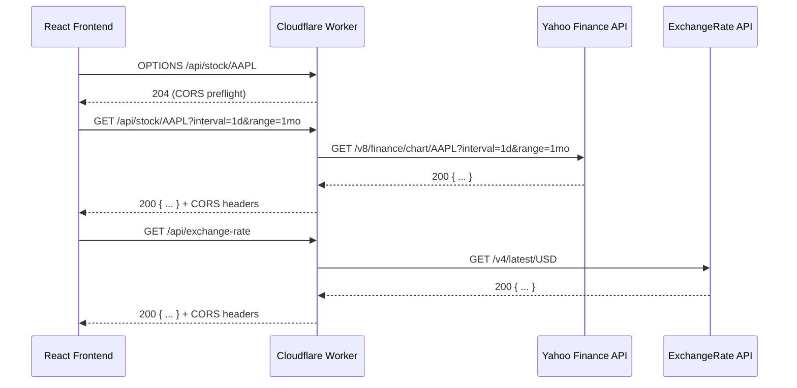

# Design Document: Stock Comparison App — Cloudflare Worker Proxy

## Overview

El Worker actúa como proxy HTTP ligero entre el frontend React (StockComparisonApp) y dos APIs externas: Yahoo Finance y ExchangeRate API. Su única responsabilidad es recibir peticiones del cliente, validarlas, reenviarlas al upstream correspondiente y devolver la respuesta al cliente con los headers CORS necesarios.

No hay estado persistente, autenticación ni transformación de datos: el Worker es un proxy transparente con validación de entrada y manejo de errores uniforme.

## Architecture



### Request routing

```
GET  /api/stock/{symbol}?interval=&range=  →  Yahoo Finance
GET  /api/exchange-rate                    →  ExchangeRate API
OPTIONS *                                  →  204 preflight response
*                                          →  404 Not Found
```

## Components and Interfaces

### Worker entry point (`src/index.js`)

```
fetch(request, env, ctx) → Response
```

Responsabilidades:
- Parsear la URL entrante y extraer ruta + parámetros
- Despachar al handler correcto según la ruta
- Aplicar headers CORS a todas las respuestas

### Route handlers

**`handleStockRequest(symbol, interval, range)`**
- Valida que `symbol`, `interval` y `range` estén presentes
- Construye la URL de Yahoo Finance
- Llama a `proxyRequest(url)`
- Devuelve la respuesta o un error estructurado

**`handleExchangeRateRequest()`**
- Llama a `proxyRequest(EXCHANGE_RATE_URL)`
- Devuelve la respuesta o un error estructurado

**`handlePreflight()`**
- Devuelve `Response(null, { status: 204 })` con headers CORS preflight

**`handleNotFound()`**
- Devuelve `Response(JSON, { status: 404 })` con `{ message: "Not found" }`

### Shared utilities

**`proxyRequest(url)`**
- Hace `fetch(url, { signal: AbortSignal.timeout(10_000) })`
- Si el upstream responde con 2xx: devuelve el body tal cual
- Si el upstream responde con 4xx/5xx: devuelve mismo status + `{ message: ... }`
- Si hay timeout (`AbortError`): devuelve 504 + `{ message: "Upstream timeout" }`

**`withCors(response)`**
- Añade `Access-Control-Allow-Origin: *` y `Content-Type: application/json` a cualquier `Response`

**`jsonResponse(body, status)`**
- Helper que construye una `Response` con body JSON serializado y status dado

## Data Models

### Request parameters

```
StockRequest {
  symbol:   string   // ticker bursátil, ej. "AAPL"
  interval: string   // granularidad, ej. "1d" | "1wk" | "1mo"
  range:    string   // período, ej. "1mo" | "3mo" | "1y"
}
```

### Response envelope (errores)

```
ErrorBody {
  message: string
}
```

Las respuestas exitosas pasan el body del upstream sin modificar.

### CORS headers

| Header                       | Valor                  | Cuándo                    |
|------------------------------|------------------------|---------------------------|
| Access-Control-Allow-Origin  | *                      | Todas las respuestas      |
| Content-Type                 | application/json       | Todas las respuestas      |
| Access-Control-Allow-Methods | GET, OPTIONS           | Solo respuestas OPTIONS   |
| Access-Control-Allow-Headers | Content-Type           | Solo respuestas OPTIONS   |

### Upstream URLs

```
YAHOO_FINANCE_BASE = "https://query1.finance.yahoo.com/v8/finance/chart"
EXCHANGE_RATE_URL  = "https://api.exchangerate-api.com/v4/latest/USD"
```

## Correctness Properties

*A property is a characteristic or behavior that should hold true across all valid executions of a system — essentially, a formal statement about what the system should do. Properties serve as the bridge between human-readable specifications and machine-verifiable correctness guarantees.*

### Property 1: CORS headers invariant

*For any* request to the Worker (ruta válida, inválida, desconocida, o preflight), la respuesta DEBE incluir el header `Access-Control-Allow-Origin: *` y `Content-Type: application/json`.

**Validates: Requirements 1.5, 1.6, 2.5, 2.6, 4.2, 5.4**

### Property 2: Proxy pass-through para respuestas exitosas

*For any* upstream mock que devuelva un status 2xx y un body arbitrario, el Worker DEBE devolver exactamente el mismo status code y el mismo body al cliente.

**Validates: Requirements 1.2, 2.2**

### Property 3: Upstream error pass-through

*For any* status code en el rango [400, 599], cuando el upstream devuelve ese status, el Worker DEBE devolver el mismo status code y un body JSON con un campo `message`.

**Validates: Requirements 1.3, 2.3**

### Property 4: Preflight OPTIONS para cualquier ruta

*For any* URL path, una petición OPTIONS DEBE recibir una respuesta 204 con los headers `Access-Control-Allow-Origin: *`, `Access-Control-Allow-Methods: GET, OPTIONS`, y `Access-Control-Allow-Headers: Content-Type`, sin llamar a ningún upstream.

**Validates: Requirements 3.1, 3.2**

### Property 5: 404 para rutas desconocidas

*For any* path que no sea `/api/stock/{symbol}` (con symbol no vacío) ni `/api/exchange-rate`, el Worker DEBE devolver HTTP 404 con un body JSON que contenga `message: "Not found"`.

**Validates: Requirements 4.1**

### Property 6: Validación de parámetros de stock

*For any* petición a `/api/stock/{symbol}` donde alguno de los parámetros requeridos (`symbol`, `interval`, `range`) esté ausente o vacío, el Worker DEBE devolver HTTP 400 con un body JSON que contenga el campo `message` indicando cuál parámetro falta.

**Validates: Requirements 5.1, 5.2, 5.3**

### Property 7: Construcción correcta de URL upstream para stock

*For any* combinación válida de `symbol`, `interval` y `range`, la URL construida para Yahoo Finance DEBE tener la forma `https://query1.finance.yahoo.com/v8/finance/chart/{symbol}?interval={interval}&range={range}`.

**Validates: Requirements 1.1**

## Error Handling

| Situación                          | Status | Body                                          |
|------------------------------------|--------|-----------------------------------------------|
| Parámetro faltante (symbol)        | 400    | `{ message: "Missing required parameter: symbol" }` |
| Parámetro faltante (interval)      | 400    | `{ message: "Missing required parameter: interval" }` |
| Parámetro faltante (range)         | 400    | `{ message: "Missing required parameter: range" }` |
| Ruta desconocida                   | 404    | `{ message: "Not found" }` |
| Upstream 4xx/5xx                   | mismo  | `{ message: <texto descriptivo> }` |
| Timeout upstream (>10s)            | 504    | `{ message: "Upstream timeout" }` |
| Error de red inesperado            | 502    | `{ message: "Bad gateway" }` |

Todos los errores incluyen `Content-Type: application/json` y `Access-Control-Allow-Origin: *`.

El timeout se implementa con `AbortSignal.timeout(10_000)`, disponible en el runtime de Cloudflare Workers con `compatibility_date >= 2023-03-01`.

## Testing Strategy

### Herramientas

- **vitest** + **@cloudflare/vitest-pool-workers**: ejecuta los tests dentro del runtime real de Cloudflare Workers, sin necesidad de mocks del entorno.
- **`SELF.fetch()`**: estilo integración, llama al Worker completo.
- **`worker.fetch(request, env, ctx)`**: estilo unitario, permite inyectar mocks de `fetch`.

### Enfoque dual

**Tests de ejemplo** (casos concretos):
- Timeout en Yahoo Finance → 504 + mensaje correcto
- Timeout en ExchangeRate → 504 + mensaje correcto
- Petición a `/api/exchange-rate` → URL upstream correcta

**Property-based tests** (propiedades universales):
- Librería: **fast-check** (`npm install --save-dev fast-check`)
- Mínimo 100 iteraciones por propiedad
- Cada test referencia la propiedad del diseño con el tag: `Feature: stock-comparison-app, Property N: <texto>`

### Cobertura por propiedad

| Propiedad | Tipo de test | Qué varía |
|-----------|-------------|-----------|
| P1: CORS headers invariant | Property | Tipo de ruta (válida, inválida, preflight) |
| P2: Proxy pass-through 2xx | Property | Status 2xx + body arbitrario del mock upstream |
| P3: Upstream error pass-through | Property | Status code en [400, 599] |
| P4: Preflight OPTIONS | Property | Path arbitrario |
| P5: 404 rutas desconocidas | Property | Paths que no coinciden con rutas conocidas |
| P6: Validación parámetros stock | Property | Combinaciones de parámetros ausentes |
| P7: URL upstream stock | Property | Combinaciones de symbol/interval/range |
| Timeout Yahoo Finance | Example | — |
| Timeout ExchangeRate | Example | — |

### Estructura de archivos de test

```
test/
  index.spec.js        # tests existentes (se reemplazarán)
  properties.spec.js   # property-based tests con fast-check
```
