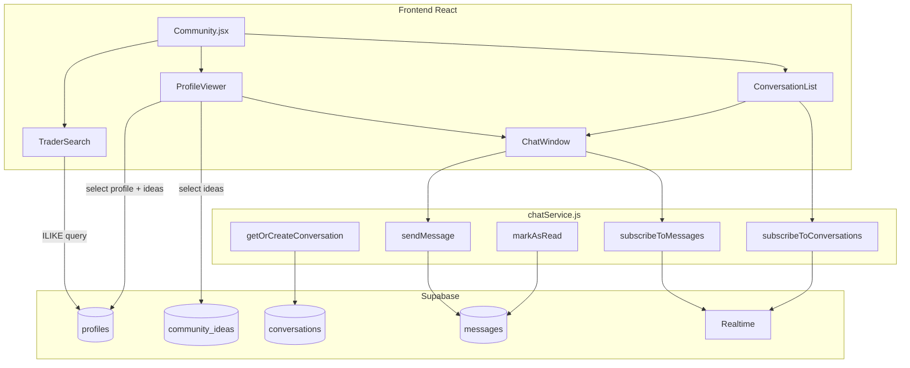

# Design Document: trader-profiles-chat

## Overview

Esta feature extiende la sección de Comunidad con dos capacidades:

1. **Perfiles públicos de traders** — cualquier usuario (anónimo o con email) puede buscar traders por `@handle` y ver un panel con su perfil público e ideas publicadas.
2. **Chat directo en tiempo real** — usuarios con email pueden iniciar conversaciones privadas 1-a-1 usando Supabase Realtime (WebSocket).

El stack existente es React + Vite en el frontend y Supabase como backend. La autenticación ya funciona (anónimo + email magic link). Las tablas `profiles` y `community_ideas` ya existen.

---

## Architecture



El flujo principal:
- `TraderSearch` consulta `profiles` con ILIKE y abre `ProfileViewer` al seleccionar.
- `ProfileViewer` carga perfil + últimas 20 ideas. Si el viewer es EmailUser y el perfil también, muestra botón "Enviar mensaje".
- Al hacer clic, `chatService.getOrCreateConversation` crea o recupera la conversación y abre `ChatWindow`.
- `ChatWindow` suscribe un `RealtimeChannel` a `messages` filtrado por `conversation_id`.
- `ConversationList` suscribe un canal a `conversations` del usuario para actualizar previews en tiempo real.

---

## Components and Interfaces

### TraderSearch

```jsx
// Props
{ lang: string, onSelectProfile: (profileId: string) => void }
```

- Input controlado con debounce de 300 ms.
- Ejecuta búsqueda solo si `query.length >= 2` (tras strip del `@` inicial).
- Muestra hasta 10 resultados con avatar fallback, `display_name` y `@handle`.
- Al seleccionar un resultado llama `onSelectProfile(profile.id)`.

### ProfileViewer

```jsx
// Props
{ profileId: string, currentUser: User | null, onClose: () => void, onOpenChat: (conversationId: string) => void }
```

- Carga perfil desde `profiles` y últimas 20 ideas desde `community_ideas`.
- Muestra avatar fallback con inicial si no hay `avatar_url`.
- Omite `bio` y `country` si son null/vacíos.
- Botón "Enviar mensaje":
  - Visible y activo: viewer es EmailUser, perfil es de otro EmailUser.
  - Visible pero deshabilitado + tooltip: viewer no es EmailUser.
  - Oculto: perfil pertenece a AnonUser.
- Al cerrar, llama `onClose()` (el padre desmonta el componente).

### ChatWindow

```jsx
// Props
{ conversationId: string, currentUser: User, otherProfile: Profile, onClose: () => void }
```

- Carga mensajes históricos ordenados por `created_at` ASC.
- Suscribe `RealtimeChannel` al montar; desuscribe al desmontar.
- Input de texto con límite visual de 1000 chars; rechaza envío si body es solo whitespace.
- Llama `chatService.markAsRead` al montar y al recibir mensajes nuevos.

### ConversationList

```jsx
// Props
{ currentUser: User | null, onOpenConversation: (conversationId: string, otherProfile: Profile) => void }
```

- Si `currentUser` no es EmailUser, muestra mensaje de requerimiento.
- Carga conversaciones del usuario ordenadas por `last_message_at` DESC.
- Suscribe canal Realtime a cambios en `conversations` del usuario.
- Muestra preview: avatar + `display_name` del otro participante, último mensaje truncado a 60 chars, timestamp relativo.
- Badge de no leídos por conversación; indicador global si total > 0.

### chatService.js

```js
// Módulo puro que encapsula toda la lógica de chat

getOrCreateConversation(supabase, userA, userB): Promise<Conversation>
sendMessage(supabase, conversationId, senderId, body): Promise<Message>
subscribeToMessages(supabase, conversationId, onMessage): RealtimeChannel
subscribeToConversations(supabase, userId, onUpdate): RealtimeChannel
markAsRead(supabase, conversationId, userId): Promise<void>
getUnreadCount(supabase, conversationId, userId): Promise<number>
```

`getOrCreateConversation` normaliza el par `(userA, userB)` poniendo el menor UUID como `participant_a` para garantizar unicidad.

---

## Data Models

### Tabla `conversations` (nueva)

```sql
create table public.conversations (
  id              uuid primary key default gen_random_uuid(),
  participant_a   uuid not null references auth.users(id) on delete cascade,
  participant_b   uuid not null references auth.users(id) on delete cascade,
  last_message_at timestamptz,
  created_at      timestamptz not null default now(),
  constraint conversations_pair_unique unique (participant_a, participant_b),
  constraint conversations_ordered check (participant_a < participant_b)
);
```

### Tabla `messages` (nueva)

```sql
create table public.messages (
  id              uuid primary key default gen_random_uuid(),
  conversation_id uuid not null references public.conversations(id) on delete cascade,
  sender_id       uuid not null references auth.users(id) on delete cascade,
  body            text not null check (char_length(body) between 1 and 1000),
  created_at      timestamptz not null default now(),
  read_by_a       boolean not null default false,
  read_by_b       boolean not null default false
);

create index messages_conversation_created_idx on public.messages(conversation_id, created_at asc);
```

### Trigger `update_last_message_at`

```sql
create or replace function public.update_conversation_last_message()
returns trigger language plpgsql security definer as $$
begin
  update public.conversations
  set last_message_at = new.created_at
  where id = new.conversation_id;
  return new;
end;
$$;

create trigger tr_update_last_message
  after insert on public.messages
  for each row execute function public.update_conversation_last_message();
```

### RLS `conversations`

```sql
-- Solo participantes pueden leer/escribir
create policy "conv_select_participant" on public.conversations for select
  using (participant_a = auth.uid() or participant_b = auth.uid());

create policy "conv_insert_participant" on public.conversations for insert
  with check (participant_a = auth.uid() or participant_b = auth.uid());
```

### RLS `messages`

```sql
-- Leer: solo si participa en la conversación
create policy "msg_select_participant" on public.messages for select
  using (
    exists (
      select 1 from public.conversations c
      where c.id = conversation_id
        and (c.participant_a = auth.uid() or c.participant_b = auth.uid())
    )
  );

-- Insertar: solo el remitente
create policy "msg_insert_own" on public.messages for insert
  with check (sender_id = auth.uid());

-- Actualizar read_by_*: solo participantes
create policy "msg_update_read" on public.messages for update
  using (
    exists (
      select 1 from public.conversations c
      where c.id = conversation_id
        and (c.participant_a = auth.uid() or c.participant_b = auth.uid())
    )
  );
```

### Realtime

```sql
alter publication supabase_realtime add table public.messages;
alter publication supabase_realtime add table public.conversations;
```

### Detección de EmailUser vs AnonUser

Supabase marca usuarios anónimos con `user.is_anonymous = true` (o `user.email == null`). El frontend usa:

```js
const isEmailUser = (user) => !!user?.email;
```

---

## Correctness Properties

*A property is a characteristic or behavior that should hold true across all valid executions of a system — essentially, a formal statement about what the system should do. Properties serve as the bridge between human-readable specifications and machine-verifiable correctness guarantees.*

### Property 1: Avatar fallback muestra la inicial correcta

*For any* `display_name` no vacío sin `avatar_url`, el componente de avatar fallback debe mostrar exactamente la primera letra del `display_name` en mayúscula.

**Validates: Requirements 1.3**

---

### Property 2: Campos opcionales ausentes no generan texto vacío

*For any* perfil donde `bio` y/o `country` son null o string vacío, el render del ProfileViewer no debe contener texto vacío ni placeholder para esos campos.

**Validates: Requirements 1.4**

---

### Property 3: Error de carga se propaga al UI

*For any* mensaje de error devuelto por Supabase al cargar un perfil o ejecutar una búsqueda, el componente correspondiente (ProfileViewer o TraderSearch) debe mostrar ese mensaje de error en el UI.

**Validates: Requirements 1.6, 2.6**

---

### Property 4: Búsqueda ILIKE con normalización de @

*For any* lista de handles y cualquier query (con o sin `@` inicial), los resultados retornados deben ser exactamente los handles que contienen el query normalizado (sin `@`, case-insensitive), y nunca más de 10.

**Validates: Requirements 2.1, 2.2, 2.7**

---

### Property 5: Búsqueda no se ejecuta con menos de 2 caracteres

*For any* query de longitud < 2 (tras normalización), la función de búsqueda no debe ser invocada y la lista de resultados debe estar vacía.

**Validates: Requirements 2.3**

---

### Property 6: Visibilidad del botón "Enviar mensaje" según tipo de usuario

*For any* combinación de (tipo de viewer, tipo de perfil visualizado):
- Si viewer es EmailUser y perfil es de otro EmailUser distinto → botón visible y habilitado.
- Si viewer no es EmailUser → botón visible pero deshabilitado.
- Si perfil pertenece a AnonUser → botón oculto.

**Validates: Requirements 3.1, 3.4, 3.6**

---

### Property 7: Idempotencia de getOrCreateConversation

*For any* par de EmailUsers distintos, llamar `getOrCreateConversation` múltiples veces debe retornar siempre el mismo `conversation_id`, garantizando que existe como máximo una conversación activa por par.

**Validates: Requirements 3.2, 3.3**

---

### Property 8: Validación de body vacío o solo whitespace

*For any* string compuesto únicamente de caracteres whitespace (espacios, tabs, newlines), el `ChatService.sendMessage` debe rechazar el envío sin persistir ningún registro.

**Validates: Requirements 4.4**

---

### Property 9: Truncado de body a 1000 caracteres

*For any* body de longitud > 1000 caracteres, el mensaje persistido en Supabase debe tener exactamente 1000 caracteres (truncado antes de persistir).

**Validates: Requirements 4.5**

---

### Property 10: Mensajes ordenados por created_at ascendente

*For any* lista de mensajes de una conversación con timestamps variados, el orden mostrado en el ChatWindow debe ser estrictamente ascendente por `created_at`.

**Validates: Requirements 4.7**

---

### Property 11: Conversaciones ordenadas por last_message_at descendente

*For any* lista de conversaciones con `last_message_at` variados, el orden mostrado en ConversationList debe ser estrictamente descendente por `last_message_at`.

**Validates: Requirements 5.1**

---

### Property 12: Preview de último mensaje truncado a 60 caracteres

*For any* mensaje cuyo body supere 60 caracteres, el texto de preview en ConversationList debe tener exactamente 60 caracteres (o menos si el body es más corto).

**Validates: Requirements 5.3**

---

### Property 13: UnreadBadge muestra el valor correcto con cap en 99+

*For any* count de mensajes no leídos N:
- Si N <= 99 → el badge muestra N.
- Si N > 99 → el badge muestra "99+".
- Si N == 0 → el badge no es visible.

**Validates: Requirements 6.1, 6.5**

---

### Property 14: Abrir conversación resetea el contador de no leídos

*For any* conversación con N > 0 mensajes no leídos, después de llamar `markAsRead`, el `getUnreadCount` para ese usuario debe retornar 0.

**Validates: Requirements 6.2**

---

### Property 15: Trigger actualiza last_message_at al insertar mensaje

*For any* mensaje insertado en una conversación, el campo `last_message_at` de esa conversación debe ser igual al `created_at` del mensaje más reciente insertado.

**Validates: Requirements 7.6**

---

## Error Handling

| Escenario | Comportamiento |
|---|---|
| Supabase no configurado (sin env vars) | `getSupabase()` retorna null; componentes muestran aviso de configuración |
| Error al cargar perfil | ProfileViewer muestra mensaje de error descriptivo; no renderiza contenido parcial |
| Error al buscar handles | TraderSearch muestra mensaje de error; limpia resultados previos |
| Error al crear conversación | ChatService rechaza la operación y propaga el error al componente |
| Error al enviar mensaje | ChatWindow muestra error inline; no cierra la ventana; permite reintentar |
| Error al marcar como leído | Se loguea en consola; no bloquea la UI (operación best-effort) |
| Usuario intenta chatear consigo mismo | `getOrCreateConversation` lanza error antes de consultar Supabase |
| Desconexión de Realtime | Supabase SDK reconecta automáticamente; no se requiere manejo adicional |

---

## Testing Strategy

### Enfoque dual

- **Unit tests con ejemplos**: comportamientos específicos, casos de error, interacciones UI concretas.
- **Property-based tests**: propiedades universales sobre lógica pura (validación, ordenamiento, truncado, normalización).

La librería de PBT elegida es **fast-check** (ya disponible en el ecosistema JS/Vitest).

### Unit tests (ejemplos y edge cases)

- ProfileViewer renderiza todos los campos cuando el perfil está completo (Req 1.1).
- ProfileViewer llama cleanup al desmontarse (Req 1.5).
- TraderSearch abre ProfileViewer al hacer clic en resultado (Req 2.4).
- TraderSearch muestra mensaje vacío cuando no hay resultados (Req 2.5).
- ChatWindow suscribe/desuscribe Realtime al montar/desmontar (Req 4.3).
- ConversationList actualiza preview al recibir mensaje via Realtime (Req 5.2).
- ConversationList muestra mensaje vacío cuando no hay conversaciones (Req 5.4).
- ConversationList muestra requerimiento de email para usuarios anónimos (Req 5.5).
- `getOrCreateConversation` rechaza cuando userA === userB (Req 3.5).

### Property-based tests (fast-check, mínimo 100 iteraciones cada uno)

Cada test referencia su propiedad del diseño con el tag:
`// Feature: trader-profiles-chat, Property N: <texto>`

| Test | Propiedad | Descripción |
|---|---|---|
| Avatar fallback inicial | Property 1 | `fc.string()` como display_name → inicial correcta |
| Campos opcionales ausentes | Property 2 | Perfiles con bio/country null/vacío → sin texto vacío |
| Error propagado al UI | Property 3 | `fc.string()` como mensaje de error → aparece en render |
| Búsqueda ILIKE + normalización @ | Property 4 | Handles y queries aleatorios → resultados correctos, ≤ 10 |
| Búsqueda no ejecutada < 2 chars | Property 5 | Queries de longitud 0-1 → sin llamadas a Supabase |
| Visibilidad botón por tipo usuario | Property 6 | Combinaciones de tipos → visibilidad correcta |
| Idempotencia getOrCreateConversation | Property 7 | Llamadas múltiples → mismo conversation_id |
| Rechazo body whitespace | Property 8 | `fc.stringOf(fc.constantFrom(' ','\t','\n'))` → rechazado |
| Truncado body 1000 chars | Property 9 | Strings de longitud > 1000 → persistido con 1000 chars |
| Orden mensajes ASC | Property 10 | Mensajes con timestamps aleatorios → orden ASC |
| Orden conversaciones DESC | Property 11 | Conversaciones con timestamps aleatorios → orden DESC |
| Truncado preview 60 chars | Property 12 | Bodies de longitud variable → preview ≤ 60 chars |
| UnreadBadge valor y cap 99+ | Property 13 | `fc.integer({ min: 0 })` → badge correcto |
| markAsRead resetea contador | Property 14 | N mensajes no leídos → 0 después de markAsRead |
| Trigger last_message_at | Property 15 | Insertar mensaje → last_message_at actualizado |

### Archivos de test

```
test/
  trader-profiles-chat.spec.js       ← unit tests (ejemplos)
  trader-profiles-chat.pbt.spec.js   ← property-based tests (fast-check)
```
