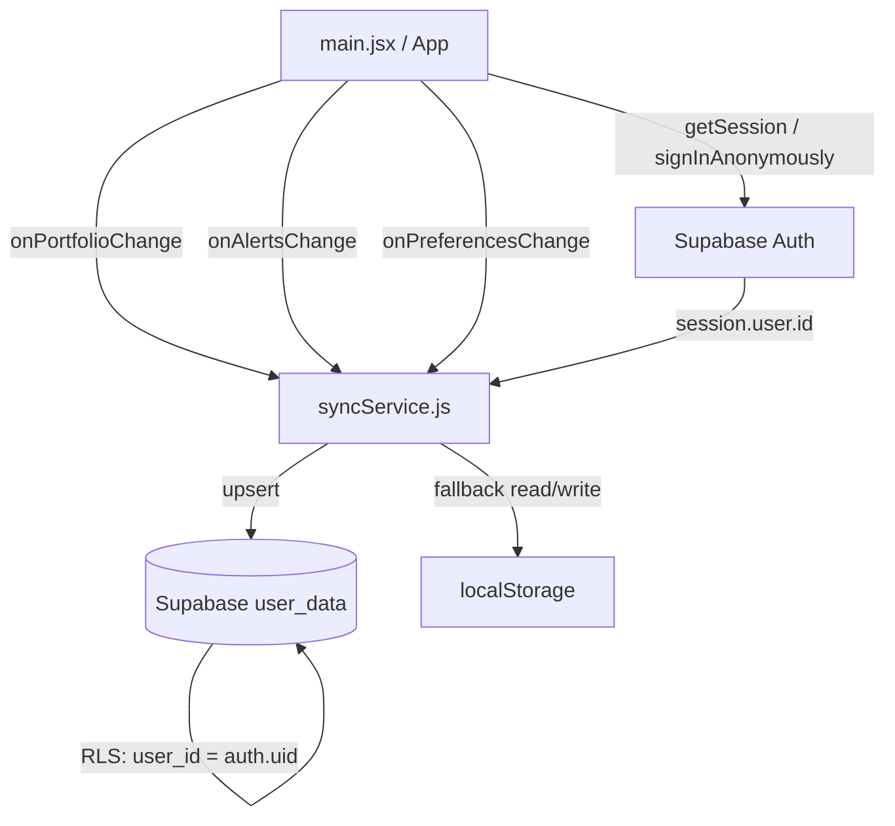
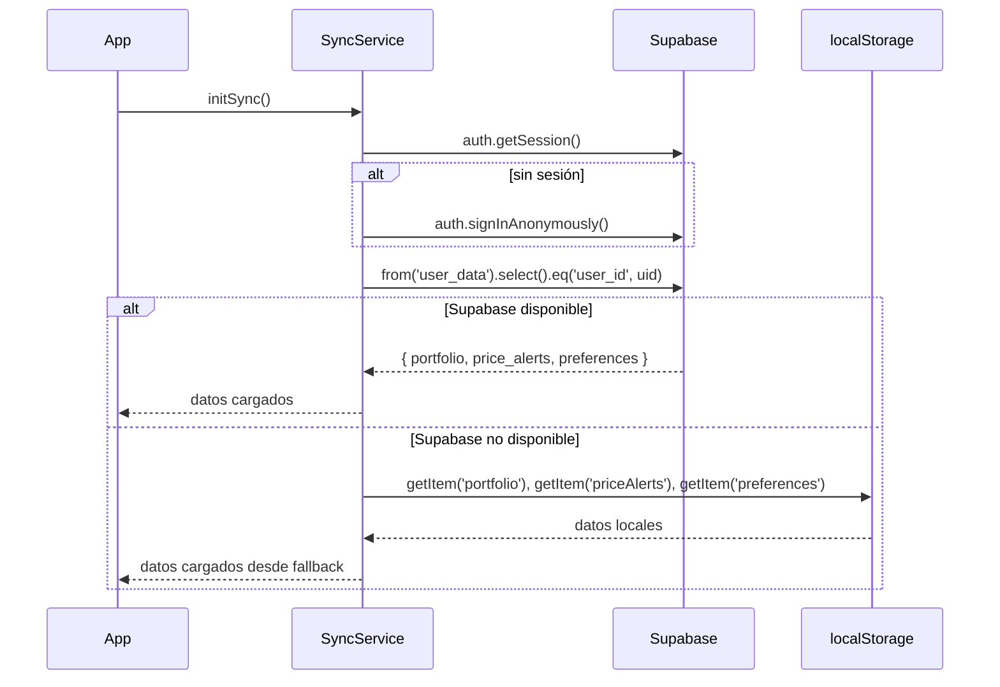
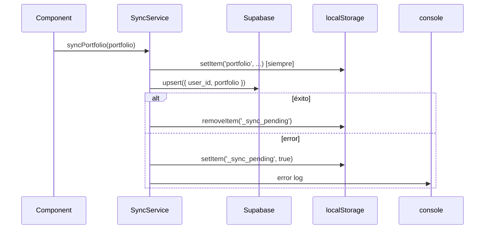

# Design Document: user-data-sync

## Overview

El SyncService es un módulo JavaScript del frontend que sincroniza el portafolio simulado, las alertas de precio y las preferencias de usuario con Supabase. Funciona para usuarios anónimos y con email, y cae de vuelta a `localStorage` cuando Supabase no está disponible.

El módulo se integra en la app React existente (`main.jsx`) sin reemplazar la lógica de estado actual: actúa como una capa de persistencia que se llama en los mismos puntos donde hoy se llama `localStorage.setItem`.

### Decisiones de diseño clave

- **Un solo módulo `syncService.js`**: toda la lógica de sync/fallback en un lugar, sin dispersarla por los componentes.
- **Tabla `user_data` separada de `profiles`**: los datos de portafolio/alertas/preferencias no mezclan con el perfil de comunidad.
- **Upsert siempre**: simplifica la lógica; no hay distinción entre crear y actualizar.
- **Fallback reactivo, no por polling**: la indisponibilidad se detecta por el error de la operación, no con `setInterval`.
- **Re-sync en la siguiente escritura exitosa**: cuando Supabase vuelve, la próxima llamada a `syncXxx()` detecta que hay datos pendientes en localStorage y los sube.

---

## Architecture



### Flujo de inicialización



### Flujo de escritura con fallback



---

## Components and Interfaces

### `syncService.js`

Módulo singleton exportado como objeto con las siguientes funciones:

```js
// Inicializa la sesión (anónima si no hay) y carga datos desde Supabase o localStorage
async function initSync(): Promise<UserData>

// Persiste el portafolio. Siempre escribe en localStorage; intenta Supabase.
async function syncPortfolio(portfolio: Portfolio): Promise<void>

// Persiste las alertas de precio.
async function syncAlerts(alerts: PriceAlert[]): Promise<void>

// Persiste las preferencias.
async function syncPreferences(preferences: Preferences): Promise<void>

// Carga todos los datos del usuario (portfolio + alerts + preferences).
async function loadUserData(): Promise<UserData>
```

**Tipo `UserData`:**
```js
{
  portfolio: Portfolio,
  alerts: PriceAlert[],
  preferences: Preferences,
}
```

### Integración en `main.jsx`

- `useEffect` al montar: llama `initSync()` y aplica los datos al estado de React.
- `setPortfolio` / `setAlerts` / `setEnabledCurrencies` / `setLang` / `setUserTimezone`: se envuelven para llamar también al `syncXxx` correspondiente.

### `AuthEmailPanel.jsx`

Sin cambios en la lógica de auth. El `onAuthStateChange` existente ya maneja `SIGNED_IN`; se añade llamada a `loadUserData()` en ese evento para recargar datos tras login.

---

## Data Models

### Tabla Supabase: `user_data`

```sql
create table public.user_data (
  user_id      uuid primary key references auth.users(id) on delete cascade,
  portfolio    jsonb not null default '{}',
  price_alerts jsonb not null default '[]',
  preferences  jsonb not null default '{}',
  updated_at   timestamptz not null default now()
);
```

### Portfolio (JSONB)

```js
{
  cash: number,               // saldo en USD
  holdings: {                 // { AAPL: { shares: number, avgCost: number } }
    [symbol: string]: { shares: number, avgCost: number }
  },
  transactions: Transaction[],
  deposits: Deposit[],
  dividendsReceived: number
}
```

### PriceAlert (JSONB array)

```js
[{
  id: number,          // timestamp
  symbol: string,      // e.g. "AAPL"
  condition: "above" | "below",
  price: number
}]
```

### Preferences (JSONB)

```js
{
  currency: string,            // e.g. "USD"
  lang: string,                // e.g. "es"
  timezone: string,            // e.g. "America/Mexico_City"
  enabledCurrencies: string[]  // e.g. ["USD", "MXN", "EUR"]
}
```

### localStorage keys

| Key | Contenido |
|-----|-----------|
| `portfolio` | JSON del Portfolio |
| `priceAlerts` | JSON array de PriceAlerts |
| `preferences` | JSON de Preferences |
| `lang` | string del idioma (compatibilidad) |
| `userTimezone` | string de timezone (compatibilidad) |
| `enabledCurrencies` | JSON array (compatibilidad) |
| `_sync_pending` | `"true"` si hay datos pendientes de subir a Supabase |

---

## Correctness Properties

*A property is a characteristic or behavior that should hold true across all valid executions of a system — essentially, a formal statement about what the system should do. Properties serve as the bridge between human-readable specifications and machine-verifiable correctness guarantees.*

### Property 1: Sync escribe el payload correcto en Supabase

*For any* portfolio, array de alertas y preferencias válidos, cuando se llama a `syncPortfolio`, `syncAlerts` o `syncPreferences`, el upsert enviado a Supabase SHALL contener exactamente los campos definidos en el modelo de datos (`cash`, `holdings`, `transactions`, `deposits`, `dividendsReceived` para portfolio; `id`, `symbol`, `condition`, `price` para cada alerta; `currency`, `lang`, `timezone`, `enabledCurrencies` para preferencias).

**Validates: Requirements 1.1, 1.5, 2.1, 3.1, 3.5**

### Property 2: Fallback a localStorage cuando Supabase falla en escritura

*For any* portfolio, array de alertas o preferencias, si Supabase devuelve un error en la operación de escritura, el SyncService SHALL escribir esos datos en localStorage y marcar `_sync_pending`.

**Validates: Requirements 1.3, 2.3, 3.3, 6.1**

### Property 3: Carga desde localStorage cuando Supabase falla en lectura

*For any* datos previamente guardados en localStorage (portfolio, alertas, preferencias), si Supabase devuelve un error en la operación de lectura, `loadUserData()` SHALL retornar los datos de localStorage.

**Validates: Requirements 1.4, 2.4, 3.4, 6.1**

### Property 4: Todas las escrituras usan upsert con el user_id correcto

*For any* user_id UUID y cualquier dato (portfolio, alertas, preferencias), todas las operaciones de escritura del SyncService SHALL usar `.upsert()` con `{ user_id }` como clave, nunca `.insert()` ni `.update()` solos.

**Validates: Requirements 4.2, 7.2**

### Property 5: Re-sincronización en la siguiente escritura exitosa

*For any* datos guardados en localStorage con `_sync_pending = true`, cuando la siguiente llamada a `syncXxx()` tiene éxito en Supabase, el SyncService SHALL subir los datos pendientes de localStorage a Supabase y limpiar `_sync_pending`.

**Validates: Requirements 6.2**

---

## Error Handling

| Escenario | Comportamiento |
|-----------|---------------|
| Supabase no configurado (sin `VITE_SUPABASE_URL`) | `getSupabase()` retorna `null`; SyncService opera solo con localStorage |
| Error en upsert de Supabase | Escribe en localStorage, marca `_sync_pending`, loguea en consola |
| Error en select de Supabase | Lee desde localStorage, loguea en consola |
| `signInAnonymously` falla | SyncService opera solo con localStorage; no bloquea la app |
| `localStorage` no disponible (SSR / privado) | try/catch silencioso; datos solo en memoria |
| `linkIdentity` falla | Supabase preserva la sesión anónima; SyncService no hace nada adicional |

---

## Testing Strategy

### Herramienta de PBT

Se usa **fast-check** (ya instalado como devDependency en `package.json`).

Los tests de frontend se ejecutan con `vitest` usando `vitest.frontend.config.js` (entorno `node`), que ya existe en el proyecto.

### Tests de propiedades (property-based)

Cada propiedad se implementa con un único test de fast-check con mínimo 100 iteraciones. Los tests mockean el cliente de Supabase y `localStorage` para ser deterministas y rápidos.

Tag format: `Feature: user-data-sync, Property N: <texto>`

**Property 1** — `syncXxx` escribe el payload correcto:
- Arbitrarios: portfolios aleatorios (cash numérico, holdings con símbolos, etc.), arrays de alertas, preferencias.
- Verificación: el mock de `supabase.from('user_data').upsert` recibió el objeto con los campos correctos.

**Property 2** — Fallback a localStorage en error de escritura:
- Arbitrarios: portfolios/alertas/preferencias aleatorios.
- Setup: mock de Supabase que rechaza con error.
- Verificación: `localStorage.setItem` fue llamado con los datos correctos y `_sync_pending` fue marcado.

**Property 3** — Carga desde localStorage en error de lectura:
- Arbitrarios: datos aleatorios pre-cargados en mock de localStorage.
- Setup: mock de Supabase que rechaza en select.
- Verificación: `loadUserData()` retorna los datos de localStorage.

**Property 4** — Upsert con user_id correcto:
- Arbitrarios: UUIDs aleatorios como user_id, datos aleatorios.
- Verificación: el método `.upsert()` fue llamado con `{ user_id: <uuid generado> }`.

**Property 5** — Re-sync en escritura exitosa:
- Arbitrarios: datos aleatorios en localStorage con `_sync_pending = true`.
- Setup: primera llamada a Supabase falla, segunda tiene éxito.
- Verificación: en la segunda llamada, Supabase recibe los datos de localStorage y `_sync_pending` se limpia.

### Tests de ejemplo (unit tests)

- `initSync()` sin sesión activa llama a `signInAnonymously`.
- `loadUserData()` con Supabase disponible retorna los datos de Supabase.
- `loadUserData()` con Supabase disponible y fila nueva retorna los valores por defecto.
- Post-`linkIdentity` exitoso: `loadUserData()` retorna los mismos datos que antes.
- Post-`linkIdentity` fallido: la sesión anónima sigue activa.

### Tests de smoke (migración SQL)

- La migración `user_data` crea la tabla con las columnas correctas.
- La política RLS permite solo `user_id = auth.uid()`.
- La política RLS aplica a usuarios anónimos.

### Cobertura de integración

Los tests de propiedades y ejemplos cubren la lógica del SyncService con mocks. Para validación end-to-end se recomienda un test de integración manual contra un proyecto Supabase de staging que verifique:
- Que un usuario anónimo puede escribir y leer su propia fila.
- Que un usuario no puede leer la fila de otro usuario (RLS).
